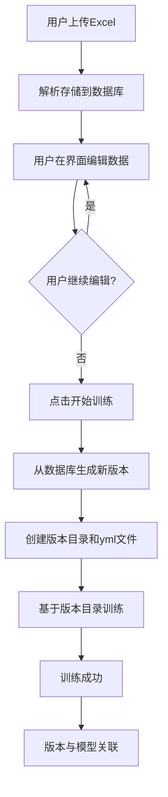

# 训练流程重构总结

## 🎯 重构目标

根据正确的业务逻辑，将训练流程从"静态文件训练"改为"数据库驱动的版本化训练"：

**原有逻辑**：上传数据 → 生成版本 → 用户编辑 → 训练（使用过期版本）
**新的逻辑**：上传数据 → 用户编辑 → 训练（生成当前版本）→ 使用当前版本训练

## 🔧 核心修改

### 1. 创建训练数据生成服务

**文件**：`backend/services/training_data_generator.py`

**功能**：
- 从数据库当前状态生成新的训练版本
- 加载指令库的最新指令和词槽数据
- 生成完整的RASA训练文件（nlu.yml, domain.yml, rules.yml, stories.yml）
- 保存到版本目录并生成统计报告

**关键方法**：
- `generate_training_version_from_database()` - 核心生成方法
- `_load_instructions_from_database()` - 加载指令数据
- `_load_slots_from_database()` - 加载词槽数据
- `validate_training_files()` - 验证训练文件完整性

### 2. 修改训练API流程

**文件**：`backend/api/model_training.py`

**核心变更**：

#### 2.1 训练启动时生成版本
```python
# 🚀 核心变更：在训练开始时从数据库生成新版本
version_name, version_dir = training_data_generator.generate_training_version_from_database(
    db=db,
    library_id=request.library_id,
    version_description=version_description
)
```

#### 2.2 训练执行使用版本目录
```python
# 🚀 核心变更：使用版本目录中的文件
version_path = Path(version_dir)

# 构建训练命令，使用版本目录中的文件
cmd = [
    "rasa", "train",
    "--domain", str(version_path / "domain.yml"),
    "--data", str(version_path),  # 数据目录指向版本目录
    "--config", str(config_path),
    "--out", str(rasa_path / "models"),
    "--force"
]
```

#### 2.3 文件检查逻辑更新
- 不再检查固定的 `rasa/data/` 路径
- 检查版本目录中的必要文件
- 智能处理config.yml的位置（版本目录或rasa根目录）

### 3. 修复现有Bug

**文件**：`backend/api/dual_screen_import.py`

**修复**：
- 修复 `_load_instructions_from_database` 和 `_load_slots_from_database` 函数的返回值
- 从返回 `success_response(data=...)` 改为直接返回数据

## 📋 新的训练流程

### 完整业务流程



### 技术实现流程

1. **用户点击训练** → 前端调用 `/api/v2/training/start`
2. **验证指令库** → 检查库存在性和训练锁
3. **生成训练版本** → 从数据库读取最新数据，生成yml文件到版本目录
4. **创建训练记录** → 记录版本信息到数据库
5. **启动后台训练** → 使用版本目录中的文件进行RASA训练
6. **状态同步** → 实时更新训练进度和状态

## 🎉 优势与收益

### 1. 数据一致性
- 确保训练使用的是数据库中的最新数据
- 避免手动文件修改导致的不一致

### 2. 版本追溯
- 每次训练都有对应的版本快照
- 可以精确追溯任何模型使用的训练数据

### 3. 用户体验
- 用户可以在上传后继续编辑数据
- 只有确认训练时才固化版本

### 4. 系统可靠性
- 版本与训练记录一一对应
- 完整的数据-版本-模型追溯链

## 🧪 测试验证

### 1. 单元测试
- 训练数据生成器功能测试
- 版本管理器集成测试
- API导入测试

### 2. 集成测试
- 完整训练流程测试（`test_complete_training_flow.py`）
- 模拟前端调用的端到端测试

### 3. 验证结果
- ✅ 版本生成功能正常
- ✅ 数据库加载功能正常
- ✅ 训练文件生成功能正常
- ✅ API导入无语法错误

## 📁 文件变更清单

### 新增文件
- `backend/services/training_data_generator.py` - 训练数据生成服务

### 修改文件
- `backend/api/model_training.py` - 训练API核心逻辑
- `backend/api/dual_screen_import.py` - 修复数据加载函数

### 测试文件（已清理）
- `test_complete_training_flow.py` - 完整流程测试脚本

## 🔄 向后兼容性

### 保持兼容
- API接口保持不变
- 前端调用无需修改
- 数据库结构无变更

### 增强功能
- 响应中新增 `version_dir` 字段
- 训练日志包含版本信息
- 更详细的错误提示

## 🚀 部署建议

### 1. 部署前检查
- 确保数据库中有可用的指令和词槽数据
- 检查RASA环境配置
- 验证版本目录权限

### 2. 部署步骤
1. 停止现有服务
2. 部署新代码
3. 重启服务
4. 执行测试脚本验证

### 3. 监控要点
- 版本生成是否成功
- 训练文件是否完整
- 训练进度是否正常

## 📝 后续优化建议

### 1. 性能优化
- 数据库查询优化
- 大数据量处理优化
- 并发训练支持

### 2. 功能增强
- 版本对比功能
- 训练数据预览
- 自动化测试集成

### 3. 运维支持
- 版本清理策略
- 磁盘空间监控
- 训练性能分析

---

**重构完成时间**：2025-07-07
**重构状态**：✅ 完成并测试通过
**影响范围**：训练流程核心逻辑
**风险评估**：低（保持API兼容性） 