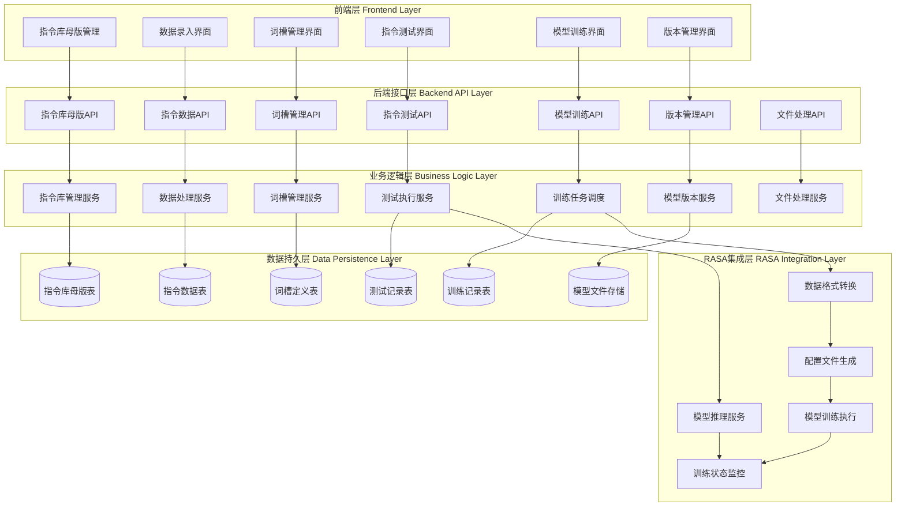
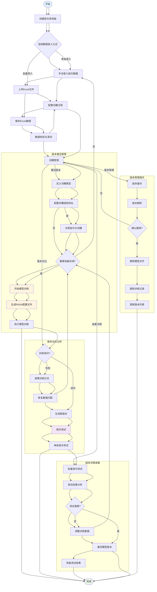
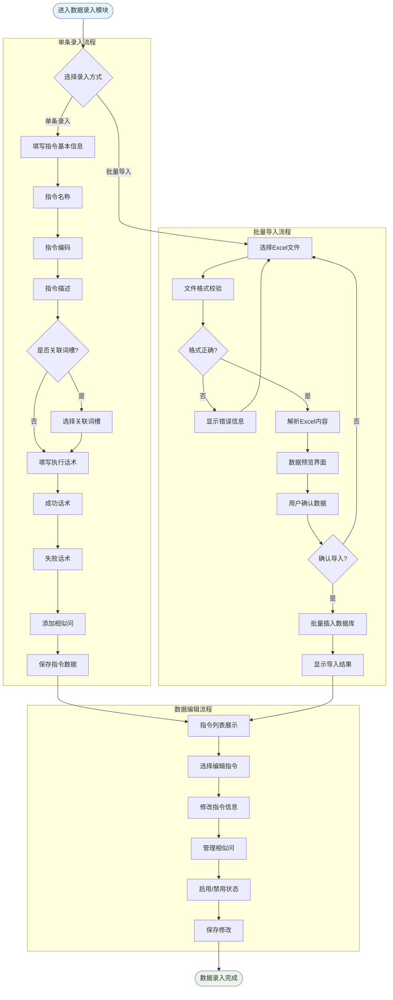
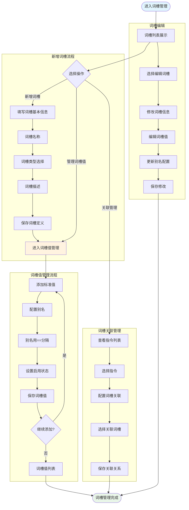
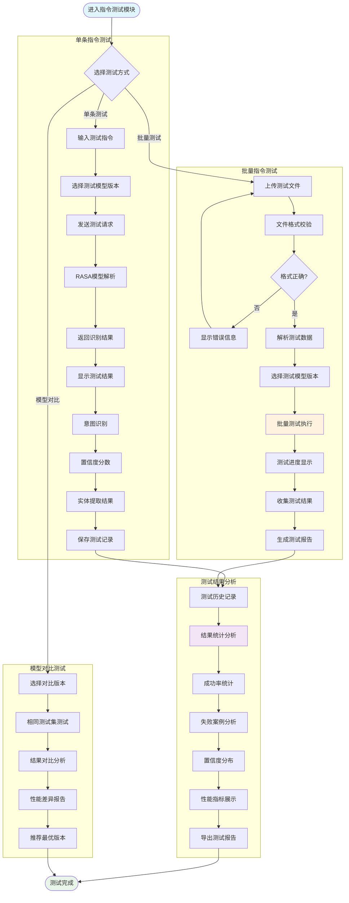
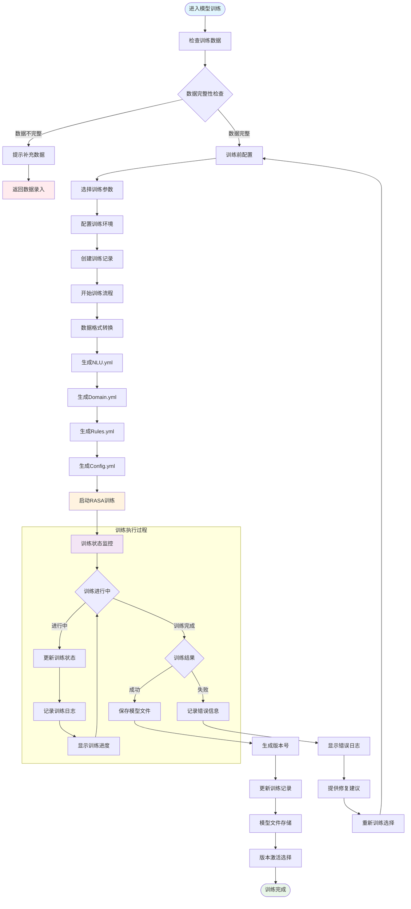
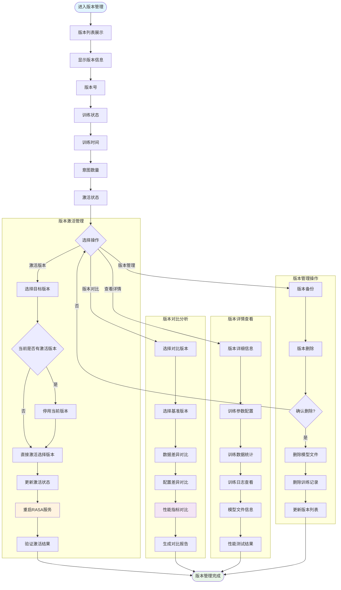

# 📋 智能对话训练平台需求理解与架构设计文档

## 🎯 完整需求理解

### 系统定位
**平台型智能对话训练系统**，支持用户通过标准化数据格式快速训练和管理多个对话模型。

### 🔑 核心业务模块

#### 1. 指令库母版管理
- **目标**: 管理不同业务场景的指令库
- **功能**: 创建、编辑指令库的基本信息（名称、语种、描述、业务编码）
- **关系**: 一个指令库母版对应多个训练版本

#### 2. 数据录入模块（含词槽管理）
- **目标**: 管理训练数据和词槽定义
- **功能**: 
  - 指令数据录入（单条/批量导入）
  - 词槽管理（词槽定义、词槽值、别名管理）
  - 指令与词槽关联配置
- **数据格式**: 支持Excel批量导入（基于`public/402/双屏指令-20250616导出.xlsx`格式）

#### 3. 指令测试模块
- **目标**: 验证训练模型的性能和准确性
- **功能**:
  - 单条指令测试
  - 批量指令测试
  - 测试结果分析和报告
  - 模型性能评估

#### 4. 模型训练模块
- **目标**: 基于录入数据训练RASA模型
- **功能**: 训练任务管理、状态监控、日志查看
- **版本管理**: 每次训练生成新版本，支持版本激活切换

#### 5. 版本管理模块
- **目标**: 管理模型的不同训练版本
- **功能**: 版本列表、版本对比、模型激活管理

## 🏗️ 系统整体架构设计



## 🔄 核心业务流程设计

### 1. 整体业务流程图



### 2. 数据录入模块详细流程图



### 3. 词槽管理模块流程图



### 4. 指令测试模块流程图




### 5. 模型训练模块流程图



### 6. 版本管理模块流程图



## 📊 完整数据库设计

### 核心表结构设计

```sql
-- 1. 指令库母版表
CREATE TABLE instruction_library_master (
    id INTEGER PRIMARY KEY AUTOINCREMENT,
    name VARCHAR(100) NOT NULL COMMENT '指令库名称',
    language VARCHAR(10) NOT NULL COMMENT '语种(zh-CN, en-US等)',
    description TEXT COMMENT '描述信息', 
    business_code VARCHAR(50) COMMENT '业务编码',
    created_by VARCHAR(50) COMMENT '创建人',
    created_time TIMESTAMP DEFAULT CURRENT_TIMESTAMP,
    updated_time TIMESTAMP DEFAULT CURRENT_TIMESTAMP,
    is_active BOOLEAN DEFAULT TRUE
);

-- 2. 指令数据表
CREATE TABLE instruction_data (
    id INTEGER PRIMARY KEY AUTOINCREMENT,
    library_id INTEGER NOT NULL COMMENT '所属指令库ID',
    instruction_name VARCHAR(100) NOT NULL COMMENT '指令名称',
    instruction_code VARCHAR(50) NOT NULL COMMENT '指令编码', 
    instruction_desc TEXT COMMENT '指令描述',
    category VARCHAR(50) COMMENT '指令分类',
    is_slot_related BOOLEAN DEFAULT FALSE COMMENT '是否关联词槽',
    related_slot_ids TEXT COMMENT '关联的词槽ID列表(JSON格式)',
    success_response TEXT COMMENT '执行成功话术',
    failure_response TEXT COMMENT '执行失败话术',
    is_enabled BOOLEAN DEFAULT TRUE COMMENT '是否启用',
    sort_order INTEGER DEFAULT 0 COMMENT '排序序号',
    created_time TIMESTAMP DEFAULT CURRENT_TIMESTAMP,
    updated_time TIMESTAMP DEFAULT CURRENT_TIMESTAMP,
    FOREIGN KEY (library_id) REFERENCES instruction_library_master(id)
);

-- 3. 相似问表
CREATE TABLE similar_questions (
    id INTEGER PRIMARY KEY AUTOINCREMENT,
    instruction_id INTEGER NOT NULL COMMENT '所属指令ID',
    question_text TEXT NOT NULL COMMENT '相似问文本',
    is_enabled BOOLEAN DEFAULT TRUE COMMENT '是否启用',
    sort_order INTEGER DEFAULT 0 COMMENT '排序序号',
    created_time TIMESTAMP DEFAULT CURRENT_TIMESTAMP,
    FOREIGN KEY (instruction_id) REFERENCES instruction_data(id) ON DELETE CASCADE
);

-- 4. 词槽定义表
CREATE TABLE slot_definitions (
    id INTEGER PRIMARY KEY AUTOINCREMENT,
    library_id INTEGER NOT NULL COMMENT '所属指令库ID',
    slot_name VARCHAR(100) NOT NULL COMMENT '词槽名称',
    slot_name_en VARCHAR(100) NOT NULL COMMENT '词槽英文名(用于RASA)',
    slot_type VARCHAR(50) NOT NULL COMMENT '词槽类型(categorical/text/float等)',
    description TEXT COMMENT '词槽描述',
    is_required BOOLEAN DEFAULT FALSE COMMENT '是否必填',
    is_active BOOLEAN DEFAULT TRUE COMMENT '是否启用',
    created_time TIMESTAMP DEFAULT CURRENT_TIMESTAMP,
    updated_time TIMESTAMP DEFAULT CURRENT_TIMESTAMP,
    FOREIGN KEY (library_id) REFERENCES instruction_library_master(id),
    UNIQUE(library_id, slot_name_en)
);

-- 5. 词槽值表  
CREATE TABLE slot_values (
    id INTEGER PRIMARY KEY AUTOINCREMENT,
    slot_id INTEGER NOT NULL COMMENT '所属词槽ID',
    standard_value VARCHAR(200) NOT NULL COMMENT '标准值',
    aliases TEXT COMMENT '别名(用==分隔)',
    description TEXT COMMENT '值描述',
    is_active BOOLEAN DEFAULT TRUE COMMENT '是否启用',
    sort_order INTEGER DEFAULT 0 COMMENT '排序序号',
    created_time TIMESTAMP DEFAULT CURRENT_TIMESTAMP,
    FOREIGN KEY (slot_id) REFERENCES slot_definitions(id) ON DELETE CASCADE
);

-- 6. 模型训练记录表
CREATE TABLE model_training_records (
    id INTEGER PRIMARY KEY AUTOINCREMENT,
    library_id INTEGER NOT NULL COMMENT '所属指令库ID',
    version_number INTEGER NOT NULL COMMENT '版本号',
    training_status VARCHAR(20) DEFAULT 'preparing' COMMENT '训练状态(preparing/training/success/failed)',
    start_time TIMESTAMP COMMENT '开始时间',
    complete_time TIMESTAMP COMMENT '完成时间', 
    intent_count INTEGER COMMENT '意图数量',
    slot_count INTEGER COMMENT '词槽数量',
    training_data_count INTEGER COMMENT '训练数据量',
    is_active BOOLEAN DEFAULT FALSE COMMENT '是否激活',
    model_file_path VARCHAR(500) COMMENT '模型文件路径',
    config_snapshot TEXT COMMENT '训练时配置快照(JSON)',
    training_log TEXT COMMENT '训练日志',
    error_message TEXT COMMENT '错误信息',
    training_params TEXT COMMENT '训练参数(JSON)',
    created_time TIMESTAMP DEFAULT CURRENT_TIMESTAMP,
    FOREIGN KEY (library_id) REFERENCES instruction_library_master(id),
    UNIQUE(library_id, version_number)
);

-- 7. 指令测试记录表
CREATE TABLE instruction_test_records (
    id INTEGER PRIMARY KEY AUTOINCREMENT,
    library_id INTEGER NOT NULL COMMENT '所属指令库ID',
    model_version_id INTEGER NOT NULL COMMENT '测试使用的模型版本ID',
    test_type VARCHAR(20) NOT NULL COMMENT '测试类型(single/batch/comparison)',
    test_name VARCHAR(100) COMMENT '测试名称',
    test_description TEXT COMMENT '测试描述',
    total_count INTEGER COMMENT '总测试数量',
    success_count INTEGER COMMENT '成功数量',
    success_rate DECIMAL(5,2) COMMENT '成功率',
    avg_confidence DECIMAL(5,2) COMMENT '平均置信度',
    test_status VARCHAR(20) DEFAULT 'running' COMMENT '测试状态(running/completed/failed)',
    start_time TIMESTAMP DEFAULT CURRENT_TIMESTAMP,
    complete_time TIMESTAMP COMMENT '完成时间',
    test_report TEXT COMMENT '测试报告(JSON)',
    created_by VARCHAR(50) COMMENT '创建人',
    FOREIGN KEY (library_id) REFERENCES instruction_library_master(id),
    FOREIGN KEY (model_version_id) REFERENCES model_training_records(id)
);

-- 8. 测试详情表
CREATE TABLE test_details (
    id INTEGER PRIMARY KEY AUTOINCREMENT,
    test_record_id INTEGER NOT NULL COMMENT '所属测试记录ID',
    input_text TEXT NOT NULL COMMENT '输入文本',
    expected_intent VARCHAR(100) COMMENT '期望意图',
    actual_intent VARCHAR(100) COMMENT '实际识别意图',
    confidence_score DECIMAL(5,2) COMMENT '置信度分数',
    extracted_entities TEXT COMMENT '提取的实体(JSON)',
    is_success BOOLEAN COMMENT '是否识别成功',
    response_time INTEGER COMMENT '响应时间(毫秒)',
    error_message TEXT COMMENT '错误信息',
    test_time TIMESTAMP DEFAULT CURRENT_TIMESTAMP,
    FOREIGN KEY (test_record_id) REFERENCES instruction_test_records(id) ON DELETE CASCADE
);

-- 9. 系统配置表
CREATE TABLE system_config (
    id INTEGER PRIMARY KEY AUTOINCREMENT,
    config_key VARCHAR(100) NOT NULL UNIQUE,
    config_value TEXT,
    config_desc TEXT COMMENT '配置描述',
    is_active BOOLEAN DEFAULT TRUE,
    updated_time TIMESTAMP DEFAULT CURRENT_TIMESTAMP
);
```

### 索引设计

```sql
-- 性能优化索引
CREATE INDEX idx_instruction_data_library_id ON instruction_data(library_id);
CREATE INDEX idx_instruction_data_enabled ON instruction_data(is_enabled);
CREATE INDEX idx_similar_questions_instruction_id ON similar_questions(instruction_id);
CREATE INDEX idx_slot_values_slot_id ON slot_values(slot_id);
CREATE INDEX idx_training_records_library_id ON model_training_records(library_id);
CREATE INDEX idx_training_records_active ON model_training_records(is_active);
CREATE INDEX idx_test_records_library_id ON instruction_test_records(library_id);
CREATE INDEX idx_test_details_record_id ON test_details(test_record_id);
```

## 🔌 完整API接口设计

### 1. 指令库母版管理API

```javascript
// 获取指令库列表
GET /api/library/list
Response: {
  "libraries": [
    {
      "id": 1,
      "name": "智能家居指令库",
      "language": "zh-CN",
      "description": "智能家居控制指令",
      "business_code": "SMART_HOME_001",
      "created_time": "2024-01-01T10:00:00",
      "instruction_count": 150,
      "latest_version": 3
    }
  ]
}

// 创建指令库
POST /api/library/create
Body: {
  "name": "新指令库",
  "language": "zh-CN",
  "description": "描述信息",
  "business_code": "BIZ_001"
}

// 获取指令库详情
GET /api/library/{id}

// 更新指令库
PUT /api/library/{id}

// 删除指令库
DELETE /api/library/{id}
```

### 2. 指令数据管理API

```javascript
// 获取指令列表
GET /api/instruction/list?library_id={id}&page={page}&size={size}

// 创建指令
POST /api/instruction/create
Body: {
  "library_id": 1,
  "instruction_name": "开灯指令",
  "instruction_code": "LIGHT_ON",
  "instruction_desc": "打开灯光",
  "category": "照明控制",
  "is_slot_related": true,
  "related_slot_ids": [1, 2],
  "success_response": "灯光已打开",
  "failure_response": "灯光打开失败",
  "similar_questions": ["打开灯", "开灯", "点亮灯光"]
}

// 批量导入指令
POST /api/instruction/batch-import
FormData: {
  "library_id": 1,
  "file": Excel文件
}

// 更新指令
PUT /api/instruction/{id}

// 删除指令
DELETE /api/instruction/{id}

// 管理相似问
POST /api/instruction/{id}/similar-questions
PUT /api/instruction/{id}/similar-questions/{question_id}
DELETE /api/instruction/{id}/similar-questions/{question_id}
```

### 3. 词槽管理API

```javascript
// 获取词槽列表
GET /api/slot/list?library_id={id}

// 创建词槽
POST /api/slot/create
Body: {
  "library_id": 1,
  "slot_name": "房间名称",
  "slot_name_en": "room_name",
  "slot_type": "categorical",
  "description": "房间位置",
  "is_required": false
}

// 获取词槽详情
GET /api/slot/{id}

// 更新词槽
PUT /api/slot/{id}

// 删除词槽
DELETE /api/slot/{id}

// 获取词槽值列表
GET /api/slot/{id}/values

// 添加词槽值
POST /api/slot/{id}/values
Body: {
  "standard_value": "客厅",
  "aliases": "大厅==会客厅==起居室",
  "description": "客厅房间"
}

// 更新词槽值
PUT /api/slot/{slot_id}/values/{value_id}

// 删除词槽值
DELETE /api/slot/{slot_id}/values/{value_id}
```

### 4. 指令测试API

```javascript
// 单条指令测试
POST /api/test/single
Body: {
  "library_id": 1,
  "model_version_id": 3,
  "input_text": "打开客厅的灯"
}
Response: {
  "intent": "light_control",
  "confidence": 0.95,
  "entities": [
    {"entity": "room_name", "value": "客厅", "start": 2, "end": 4}
  ],
  "response_time": 120
}

// 批量指令测试
POST /api/test/batch
FormData: {
  "library_id": 1,
  "model_version_id": 3,
  "test_file": CSV文件,
  "test_name": "功能验证测试"
}

// 获取测试记录列表
GET /api/test/records?library_id={id}

// 获取测试详情
GET /api/test/records/{id}/details

// 获取测试报告
GET /api/test/records/{id}/report

// 模型对比测试
POST /api/test/comparison
Body: {
  "library_id": 1,
  "version_ids": [2, 3],
  "test_file": "same_test_set.csv"
}
```

### 5. 模型训练API

```javascript
// 开始训练
POST /api/training/start
Body: {
  "library_id": 1,
  "training_params": {
    "epochs": 100,
    "batch_size": 32
  }
}

// 获取训练状态
GET /api/training/status/{record_id}
Response: {
  "status": "training",
  "progress": 65,
  "current_step": "Training DIET",
  "elapsed_time": 1800,
  "estimated_remaining": 900
}

// 获取训练记录列表
GET /api/training/records?library_id={id}

// 获取训练日志
GET /api/training/records/{id}/logs

// 停止训练
POST /api/training/stop/{record_id}
```

### 6. 版本管理API

```javascript
// 获取版本列表
GET /api/version/list?library_id={id}

// 激活模型版本
POST /api/version/activate/{record_id}

// 版本对比
POST /api/version/compare
Body: {
  "library_id": 1,
  "base_version_id": 2,
  "compare_version_id": 3
}

// 删除版本
DELETE /api/version/{record_id}

// 版本详情
GET /api/version/{record_id}/details
```

## 🎨 前端页面详细设计

### 页面结构树

```
App.js (主应用)
├── Header.js (顶部导航)
├── Sidebar.js (侧边栏)
└── 主内容区 (Routes)
    ├── LibraryMaster.js (指令库母版管理)
    │   ├── LibraryList.js (库列表)
    │   ├── LibraryForm.js (新建/编辑库)
    │   └── LibraryDetail.js (库详情)
    │
    ├── DataEntry.js (数据录入模块)
    │   ├── InstructionList.js (指令列表)
    │   ├── InstructionForm.js (指令表单)
    │   ├── BatchImport.js (批量导入)
    │   ├── SlotManagement.js (词槽管理)
    │   │   ├── SlotList.js (词槽列表)
    │   │   ├── SlotForm.js (词槽表单)
    │   │   └── SlotValues.js (词槽值管理)
    │   └── SimilarQuestions.js (相似问管理)
    │
    ├── InstructionTest.js (指令测试模块)
    │   ├── SingleTest.js (单条测试)
    │   ├── BatchTest.js (批量测试)
    │   ├── TestHistory.js (测试历史)
    │   ├── TestReport.js (测试报告)
    │   └── ModelComparison.js (模型对比)
    │
    ├── ModelTraining.js (模型训练模块)
    │   ├── TrainingConfig.js (训练配置)
    │   ├── TrainingMonitor.js (训练监控)
    │   ├── TrainingHistory.js (训练历史)
    │   └── TrainingLogs.js (训练日志)
    │
    └── VersionManagement.js (版本管理模块)
        ├── VersionList.js (版本列表)
        ├── VersionDetail.js (版本详情)
        ├── VersionComparison.js (版本对比)
        └── VersionActivation.js (版本激活)
```

## 🔍 现有系统复用性详细分析

### ✅ 高复用性模块 (80%以上复用)

#### 基础设施层
- **数据库连接**: `backend/database.py` - 100%复用
- **基础配置**: `backend/app.py` Flask应用配置 - 90%复用
- **工具函数**: `src/utils/timeUtils.js` - 100%复用
- **样式系统**: `src/styles/colors.js`, `src/index.css` - 100%复用

#### RASA基础层
- **配置管理脚本**: `rasa/versions/` 下的版本管理工具 - 85%复用
- **基础配置**: `rasa/config.yml`, `rasa/credentials.yml` - 90%复用

### ⚡ 中等复用性模块 (40-80%复用)

#### 文件处理
- **Excel处理**: `backend/services/excel_processor.py` - 60%复用，需要适配新格式
- **文件上传**: 前端文件上传逻辑 - 70%复用

#### 通用组件
- **加载组件**: `src/components/CustomLoading.js` - 100%复用
- **API调用**: `src/api.js` - 50%复用，需要新增接口

### 🔄 低复用性模块 (40%以下复用)

#### 前端页面
- **所有页面组件**: 需要重新设计 - 20%复用
- **状态管理**: 需要适配新业务模型 - 30%复用

#### 后端业务逻辑  
- **API接口**: `backend/api/` - 30%复用，大部分需要重写
- **数据模型**: `backend/models/schemas.py` - 10%复用，几乎重写
- **业务服务**: `backend/services/` - 40%复用

## 📅 开发实施计划

### 第一阶段：基础框架重构 (2-3周)
1. **数据库重构** (3天)
   - 设计并创建新表结构
   - 数据迁移脚本
   - 基础数据初始化

2. **后端基础API** (5天)  
   - 指令库母版管理API
   - 基础数据模型重构
   - API响应格式标准化

3. **前端基础框架** (4天)
   - 页面路由重构
   - 主界面框架搭建
   - 通用组件优化

### 第二阶段：核心功能开发 (3-4周)
1. **数据录入模块** (7天)
   - 指令数据CRUD功能
   - Excel批量导入优化
   - 相似问管理

2. **词槽管理模块** (5天)
   - 词槽定义管理
   - 词槽值和别名管理
   - 指令与词槽关联

3. **前端界面开发** (8天)
   - 数据录入界面
   - 词槽管理界面
   - 交互优化

### 第三阶段：测试与训练模块 (3-4周)
1. **指令测试模块** (8天)
   - 单条/批量测试功能
   - 测试结果分析
   - 模型对比功能

2. **模型训练模块** (6天)
   - RASA集成适配
   - 训练流程重构
   - 状态监控优化

3. **前端测试训练界面** (6天)
   - 测试界面开发
   - 训练监控界面
   - 结果展示优化

### 第四阶段：版本管理与优化 (2-3周)
1. **版本管理模块** (5天)
   - 版本列表和详情
   - 版本激活切换
   - 版本对比分析

2. **系统优化** (5天)
   - 性能优化
   - 错误处理完善
   - 用户体验优化

3. **测试与部署** (5天)
   - 完整功能测试
   - 性能测试
   - 部署脚本优化

## 🎯 技术风险评估与缓解策略

### 主要技术风险
1. **数据库迁移风险**: 现有数据结构变化大
   - **缓解策略**: 分步迁移，保留原始数据备份

2. **RASA集成复杂性**: 新版本管理模式集成
   - **缓解策略**: 保留现有训练脚本，渐进式改造

3. **前端重构工作量**: 页面结构变化大
   - **缓解策略**: 复用现有组件，分模块开发

4. **训练稳定性**: 平台化后的训练稳定性
   - **缓解策略**: 充分测试，错误处理机制完善

### 成功标准定义
1. **功能完整性**: 支持完整的平台化训练流程
2. **易用性**: 非技术用户可以独立完成操作
3. **稳定性**: 训练成功率95%以上
4. **性能**: 批量操作响应时间在可接受范围
5. **扩展性**: 支持多个指令库并行管理

---

## 📋 文档总结

本需求理解文档涵盖了智能对话训练平台的完整设计，包括：

- ✅ **5个核心业务模块**的完整流程设计
- ✅ **完整的数据库设计**包含9个核心表
- ✅ **详细的API接口设计**支持所有业务场景  
- ✅ **前端页面架构**和组件复用策略
- ✅ **现有系统复用性分析**最大化代码复用
- ✅ **分阶段开发计划**和风险缓解策略

**系统已准备就绪，等待您的开发确认指令！** 🚀